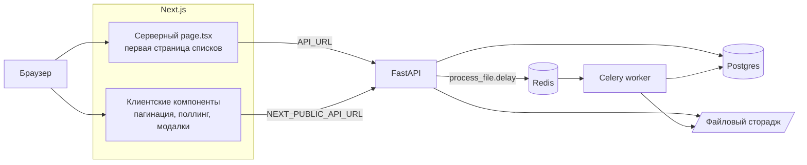
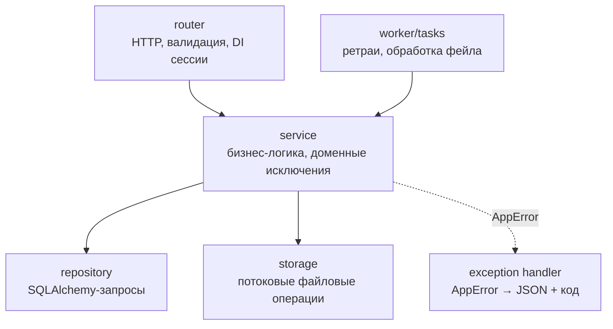
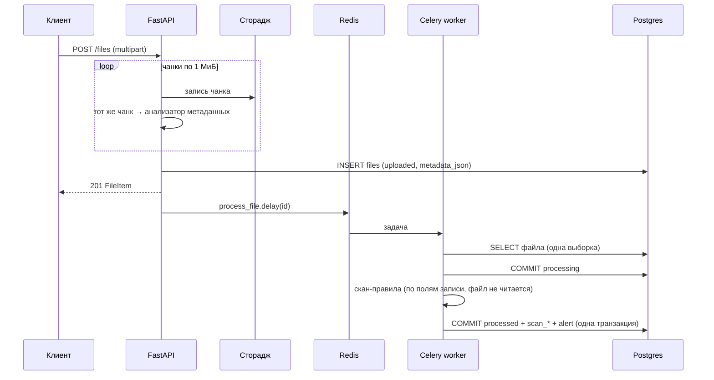
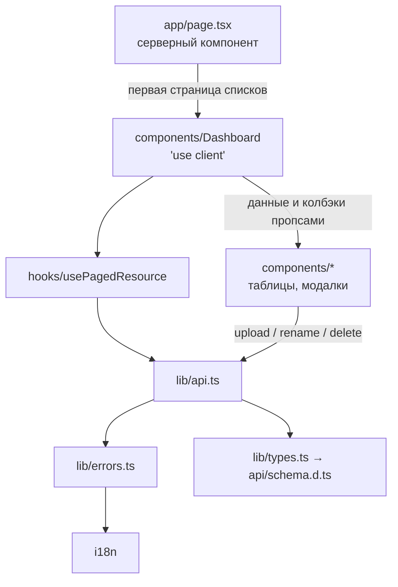

# Файловый сервис — решение тестового задания

[](https://github.com/ProjectINT/fullstack-test-task-phyton/actions/workflows/e2e.yml)
[](https://github.com/ProjectINT/fullstack-test-task-phyton/actions/workflows/api-contract.yml)

Файлообменник: загрузка файла → асинхронная проверка на подозрительный контент →
извлечение метаданных → алерт. Бэкенд — FastAPI + Celery + Postgres + Redis,
фронтенд — Next.js (App Router).

Это решение [исходного задания](#12-исходное-задание): рефакторинг бэкенда и
фронтенда **без изменения бизнес-логики**, оба дополнительных пункта
(неочевидная оптимизация и разделение фронтенда на слои), плюс исправление
найденных багов и тесты трёх уровней.

---

## Содержание

1. [Обзор](#1-обзор) · [С чего начать ревью](#11-с-чего-начать-ревью) · [Исходное задание](#12-исходное-задание)
2. [Быстрый старт](#2-быстрый-старт)
3. [Архитектура](#3-архитектура)
4. [Конвейер обработки и оптимизация](#4-конвейер-обработки-и-оптимизация)
5. [Фронтенд: слои](#5-фронтенд-слои)
6. [Контракт API](#6-контракт-api)
7. [Найденные баги и что с ними сделано](#7-найденные-баги-и-что-с-ними-сделано)
8. [Новая функциональность](#8-новая-функциональность)
9. [Тесты](#9-тесты)
10. [CI](#10-ci)
11. [Структура репозитория](#11-структура-репозитория)
12. [Что осталось за рамками](#12-что-осталось-за-рамками)

---

## 1. Обзор

Что изменилось относительно исходного MVP:

| Область | Было | Стало |
|---|---|---|
| Бэкенд | 5 файлов в `src/` (385 строк), конфиг + инфраструктура + бизнес-логика вперемешку, `HTTPException` в сервисе | 19 модулей (759 строк) по слоям `router → service → repository/storage`, домен не знает про HTTP |
| Конвейер | 3 Celery-задачи, 3 engine/сессии, файл читается дважды целиком в память | 1 задача, 1 сессия, 1 выборка; метаданные считаются в том же потоковом проходе, что и запись на диск |
| Надёжность | 9 багов (падение `DELETE`, гонки event loop, OOM, зависание в `processing`) | все исправлены, на каждый — регрессионный тест |
| Фронтенд | один клиентский компонент `page.tsx` на 367 строк, `strict: false`, типов React нет | слои `app / components / hooks / lib / i18n / api`, `strict: true`, типы генерируются из OpenAPI |
| Тесты | нет | 67 pytest + 2 vitest + 56 Playwright |
| CI | нет | 2 workflow: E2E на поднятом стеке и проверка дрифта API-контракта |

Планы, по которым велась работа (аудит + пофазная разбивка), лежат в [`docs/`](docs):

- [`docs/backend-refactoring-plan.md`](docs/backend-refactoring-plan.md) — аудит бэкенда, целевая архитектура, шаги;
- [`docs/frontend-refactoring-plan.md`](docs/frontend-refactoring-plan.md) — аудит фронтенда и фазы;
- [`docs/e2e-test-plan.md`](docs/e2e-test-plan.md) — план E2E по фазам и статус выполнения.

Это рабочие планы на момент старта, а не спецификация: где итоговое решение
разошлось с планом, приоритет у кода — расхождения отмечены по ходу этого README
(самое заметное — конвейер в [разделе 4](#4-конвейер-обработки-и-оптимизация)).

### 1.1 С чего начать ревью

Если смотреть только пять файлов, то эти:

| Файл | Зачем смотреть |
|---|---|
| [`backend/src/files/service.py`](backend/src/files/service.py) | Вся бизнес-логика: потоковая загрузка, скан-правила, конвейер обработки одним проходом |
| [`backend/src/core/db.py`](backend/src/core/db.py) | Одна точка создания engine; отдельная сессия для Celery — здесь лежит фикс гонки event loop |
| [`backend/src/worker/tasks.py`](backend/src/worker/tasks.py) | Тонкая обёртка над сервисом: ретраи, перевод файла в `failed`, critical-алерт |
| [`frontend/src/hooks/usePagedResource.ts`](frontend/src/hooks/usePagedResource.ts) | Пагинация + отмена гонок запросов + тихий поллинг поверх серверного рендера |
| [`frontend/src/lib/errors.ts`](frontend/src/lib/errors.ts) | Типизированные ошибки API и единственная точка превращения их в текст для пользователя |

История разбита на осмысленные коммиты по трём веткам, каждая влита отдельным
PR: `backend-refactoring` (#1) → `frontend-refactoring-and-fixes` (#2) →
`e2e-tests-and-types` (#3). В `main` уже всё, так что смотреть можно и его
целиком, и каждый PR по отдельности.

### 1.2 Исходное задание

> **Вводные:**
> 1. Здесь представлен MVP проект файлообменника. Он позволяет загружать файлы, проверяет их на подозрительный контент и отправляет алерты;
> 2. Репозиторий содержит в себе бэкенд и фронтенд части;
> 3. В обоих частях присутствуют баги, неоптимизированный код, неудачные архитектурные решения.
>
> **Задачи:**
> 1. Проведите рефакторинг бэкенда, не ломая бизнес-логики: предложите свое видение архитектуры и реализуйте его;
> 2. (Дополнительно) На бэкенде есть возможность неочевидной оптимизации — выполните ее;
> 3. (Дополнительно) Разбейте логику фронтенда на слои.

Все три пункта выполнены: архитектура — [раздел 3](#3-архитектура), оптимизация —
[раздел 4](#4-конвейер-обработки-и-оптимизация), слои фронтенда — [раздел 5](#5-фронтенд-слои).

---

## 2. Быстрый старт

```bash
docker compose -f docker-compose.dev.yml up --build
docker exec -it backend alembic upgrade head
```

- фронтенд — <http://localhost:3000>
- Swagger — <http://localhost:8000/docs>

Миграции применяются отдельной командой намеренно: приложение не трогает схему БД
на старте. Postgres поднимается дольше бэкенда, поэтому при первом запуске
`alembic upgrade head` иногда нужно повторить (в CI это сделано ретраями).

### Локальные проверки

```bash
# бэкенд: 67 тестов на SQLite во временном каталоге — Postgres, Redis и Docker не нужны
cd backend && uv run pytest -q

# фронтенд
cd frontend && npm ci
npm run lint && npm run typecheck && npm test && npm run build

# e2e: нужен поднятый стек (см. выше)
cd e2e && npm ci && npm run install:browsers && npm test
```

Проект требует Python 3.14 и [`uv`](https://docs.astral.sh/uv/getting-started/installation/)
(`uv run` сам поставит зависимости, включая dev-группу). Если ставить uv не
хочется, тесты бэкенда гоняются в уже поднятом контейнере — dev-группа
доустанавливается поверх образа, который собран с `UV_NO_DEV=1`:

```bash
docker exec -e UV_NO_DEV=0 -w /backend backend sh -c 'uv run --group dev pytest -q'
```

### Переменные окружения

| Переменная | Где задаётся | Значение по умолчанию | Назначение |
|---|---|---|---|
| `POSTGRES_USER` / `POSTGRES_PASSWORD` / `POSTGRES_DB` / `POSTGRES_HOST` / `PGPORT` | [`.env.dev`](.env.dev) | `postgres` / `postgres` / `test` / `backend-db` / `5433` | из них собирается `DATABASE_URL` |
| `CELERY_BROKER_URL` | [`.env.dev`](.env.dev) | `redis://backend-redis:6379/0` | брокер и backend результатов Celery |
| `STORAGE_DIR` | — | `backend/storage/files` | каталог хранения файлов |
| `MAX_FILE_SIZE` | — | `104857600` (100 МиБ) | жёсткий лимит на загрузку → `413` |
| `NEXT_PUBLIC_API_URL` | build-arg фронтенда в compose | `http://localhost:8000` | URL API **для браузера** (инлайнится на билде) |
| `API_URL` | `environment` фронтенда в compose | `http://backend:8000` | URL API **для серверных компонентов Next** внутри docker-сети |

Разделение `NEXT_PUBLIC_API_URL` / `API_URL` — не дублирование: первый попадает в
бандл и должен быть достижим из браузера пользователя, второй читается только на
сервере Next, где `localhost` указывал бы на сам контейнер фронтенда.

[`.env.dev`](.env.dev) закоммичен намеренно — это dev-дефолты для локального
compose, а не секреты; файл не менялся с исходного коммита.

Все настройки бэкенда собраны в одном классе `Settings`
([`backend/src/core/config.py`](backend/src/core/config.py)); `os.environ` по коду
больше нет. Сам `Settings` `.env`-файлы не читает — переменные приходят из
окружения процесса (в compose их подставляет `env_file: .env.dev`), а дефолты
рассчитаны на docker-сеть, поэтому запуск бэкенда вне Docker требует явных
переменных.

---

## 3. Архитектура

### 3.1 Общая схема



### 3.2 Бэкенд: слои

Исходно `service.py` был одновременно конфигом (`DB_URL` из `os.environ`),
инфраструктурой (engine, session_maker, путь до стораджа) и бизнес-логикой,
а роутеры лежали в `app.py`. Разложено по слоям с одним правилом:
**наружу из сервиса летят доменные исключения, в HTTP их превращает хендлер**, —
поэтому одна и та же функция вызывается и из HTTP-роутера, и из Celery-задачи.

```
backend/src/
├── main.py                 # сборка FastAPI: CORS, хендлеры исключений, роутеры
├── core/
│   ├── config.py           # pydantic-settings: БД, брокер, storage_dir, max_file_size
│   ├── db.py               # Base, engine, get_session (DI), worker_session
│   ├── exceptions.py       # AppError → FileNotFound / EmptyFile / FileTooLarge / ...
│   └── pagination.py       # limit ∈ [1, 1000] (default 100), offset ≥ 0
├── files/
│   ├── router.py           # эндпоинты /files
│   ├── service.py          # бизнес-логика: загрузка, скан, метаданные, конвейер
│   ├── repository.py       # запросы к БД
│   ├── storage.py          # потоковый файловый сторадж на aiofiles
│   ├── models.py           # StoredFile
│   ├── schemas.py          # FileItem, FileUpdate
│   └── enums.py            # ProcessingStatus, ScanStatus
├── alerts/
│   ├── router.py           # /alerts (+ join с files ради file_title)
│   ├── repository.py
│   ├── models.py           # Alert (FK ON DELETE CASCADE + индекс)
│   ├── schemas.py
│   └── enums.py            # AlertLevel
└── worker/
    ├── celery_app.py       # конфиг Celery из настроек
    └── tasks.py            # ретраи и обработка окончательного фейла
```



Ключевые решения:

- **Одна точка создания engine.** Раньше их было два — в `service.py` и в
  `tasks.py`, причём API-процесс импортировал `tasks.py` и получал оба. Теперь
  engine живёт только в [`core/db.py`](backend/src/core/db.py).
- **Сессия на запрос, а не на вызов функции.** API получает её через
  `Depends(get_session)`; операции внутри запроса можно объединять в одну транзакцию.
- **Отдельная сессия для воркера.** `worker_session()` создаёт engine с `NullPool`
  и освобождает его по завершении задачи — соединения не переживают event loop
  задачи (подробнее в [B3](#7-найденные-баги-и-что-с-ними-сделано)).
- **Статусы — `StrEnum`, а не строки.** `ProcessingStatus`, `ScanStatus`,
  `AlertLevel` используются в моделях, схемах и OpenAPI; в БД пишутся значения
  (`"processed"`), а не имена членов — за это отвечает хелпер `status_column`.
- **Доменные исключения вместо `HTTPException`.** `AppError` и наследники несут
  свой `status_code`; `register_exception_handlers` — единственное место, где
  домен встречается с транспортом.

### 3.3 Модель данных

`files`

| Поле | Тип | Комментарий |
|---|---|---|
| `id` | `String(36)` PK | UUID4 |
| `title`, `original_name`, `stored_name`, `mime_type` | `String` | `stored_name` уникален |
| `size` | `BigInteger` | был `Integer` → переполнение на файлах > 2 ГБ |
| `processing_status` | enum | `uploaded` → `processing` → `processed` \| `failed` |
| `scan_status` | enum, nullable | `clean` \| `suspicious` \| `failed` |
| `scan_details` | `String(500)` | человекочитаемая причина |
| `metadata_json` | `JSON` | считается на загрузке (см. [раздел 4](#4-конвейер-обработки-и-оптимизация)) |
| `requires_attention` | `Boolean` | |
| `created_at` / `updated_at` | `DateTime(tz)` | `server_default`, приходят через `RETURNING` (`eager_defaults`) |

`alerts` — `file_id` с `ON DELETE CASCADE` и индексом, `level` enum, `message`,
`created_at`. Обе правки схемы (каскад + `BigInteger`) — в миграции
[`a1c47f0e52b8`](backend/migrations/versions/a1c47f0e52b8_alerts_file_id_cascade.py).

---

## 4. Конвейер обработки и оптимизация

Это дополнительное задание №2 — «неочевидная оптимизация».

**Было.** Три Celery-задачи, связанные `.delay()` внутри тел друг друга:
`scan_file_for_threats` → `extract_file_metadata` → `send_file_alert`. Каждая
открывала свою сессию и заново доставала запись из БД. Плюс файл читался
**целиком в память дважды**: `await upload_file.read()` при загрузке и
`stored_path.read_bytes()` / `read_text()` при извлечении метаданных — блокирующим
вызовом внутри корутины.

**Стало.** Одна задача `process_file`, один проход:



Что именно даёт выигрыш:

1. **Метаданные считаются в том же потоковом проходе, что и запись на диск.**
   Размер, MIME и расширение и так известны на загрузке; число строк/символов для
   `text/*` и количество маркеров `/Type /Page` для PDF досчитываются на лету
   инкрементальными анализаторами (`_TextStatsAnalyzer`, `_PdfPageAnalyzer`).
   Оба корректно обрабатывают границы чанков — multibyte-символ и маркер, разрезанные
   пополам, не теряются. **Содержимое файла воркер не читает вообще** — только
   проверяет, что файл на месте.
2. **Три задачи → одна.** Вместо трёх engine, трёх сессий и трёх выборок записи —
   один engine, одна сессия, одна выборка.
3. **Одна транзакция на результат.** Результат скана, метаданные и алерт
   коммитятся вместе: не бывает состояния «скан прошёл, а алерта нет».
4. **Ни одного блокирующего вызова в async-контексте.** Запись и чтение идут
   чанками по 1 МиБ через `aiofiles`, проверка существования и удаление — через
   `aiofiles.os`. Лимит `MAX_FILE_SIZE` проверяется прямо в потоке: файл сверх
   лимита не дочитывается до конца, а недописанный кусок удаляется.
5. **`session.refresh()` после коммита убран** — при `expire_on_commit=False`
   он нужен только ради server_default-полей, которые теперь приходят через
   `RETURNING` (`__mapper_args__ = {"eager_defaults": True}`).

Обратная совместимость: `_ensure_metadata()` досчитывает метаданные одним
потоковым проходом для записей, загруженных до этой оптимизации.

В [плане](docs/backend-refactoring-plan.md) рассматривались два варианта — связать
шаги через Celery `chain` или слить их в один проход. Выбран второй: `chain`
сохранил бы три задачи с тремя сессиями и тремя выборками ради шагов, которые
всё равно никогда не выполняются по отдельности.

**Правила скана** (не менялись — бизнес-логика сохранена):

| Условие | Результат |
|---|---|
| расширение из `.exe .bat .cmd .sh .js` | `suspicious`, причина `suspicious extension {ext}` |
| размер > 10 МиБ | `suspicious`, причина `file is larger than 10 MB` |
| `.pdf` с MIME не из `application/pdf` \| `application/octet-stream` | `suspicious`, причина `pdf extension does not match mime type` |
| ничего из перечисленного | `clean`, `scan_details = "no threats found"` |

Причины складываются: `.exe` размером 11 МиБ даёт обе. По результату создаётся
алерт — `warning` при `requires_attention`, иначе `info`.

**Отказоустойчивость.** Задача наследует `FileProcessingTask`
(`autoretry_for=(Exception,)`, `max_retries=3`, `retry_backoff=True`). Когда
ретраи исчерпаны, `on_failure` переводит файл в `failed` и создаёт
`critical`-алерт — раньше файл навсегда оставался в `processing`. Повторный
прогон уже обработанного файла — no-op, дубликат алерта не создаётся.

---

## 5. Фронтенд: слои

Это дополнительное задание №3. Было: один клиентский компонент `page.tsx` на
367 строк, внутри которого жили `fetch`, типы, форматтеры, разметка и состояние.

```
frontend/src/
├── app/               # роутинг Next: layout, серверный page, loading, error
├── components/        # презентационные компоненты (таблицы, модалки, бейдж, пагинация)
├── hooks/             # usePagedResource — состояние списка: страницы, refetch, поллинг
├── lib/
│   ├── api.ts         # транспорт: базовый URL, таймаут, разбор ошибок, эндпоинты
│   ├── errors.ts      # ApiError + toUserMessage — единственная точка текста ошибки
│   ├── format.ts      # formatDate / formatSize
│   └── types.ts       # реэкспорт типов контракта
├── i18n/              # словарь ru.json + t() / useTranslations()
└── api/               # schema.d.ts — сгенерирован из OpenAPI, руками не правится
```



Решения, на которые стоит обратить внимание:

- **Серверный рендер первой страницы.** `app/page.tsx` — серверный компонент: он
  забирает первые страницы файлов и алертов и отдаёт их готовыми, без спиннера и
  клиентского запроса. `loading.tsx` показывается на время загрузки,
  `error.tsx` — если бэкенд недоступен. Клиентским остаётся только то, что
  действительно интерактивно (`Dashboard` и компоненты под ним).
- **`usePagedResource` — одно состояние на ресурс.** Раньше один `isLoading` на
  обе таблицы заменял их спиннером при каждом обновлении, а повторные клики по
  «Обновить» могли прийти в обратном порядке. Теперь: `AbortController` отменяет
  предыдущий запрос, при refetch таблица не исчезает (только приглушается),
  а «тихий» режим для поллинга не показывает спиннер вообще.
- **Пагинация «+1 элемент».** Хук запрашивает `limit = pageSize + 1` (21 при
  `DEFAULT_PAGE_SIZE = 20`): лишний элемент — признак того, что следующая
  страница есть. Отдельного count-эндпоинта не потребовалось. Опустевшая
  страница (например, после удаления последней записи) автоматически возвращает
  на предыдущую.
- **Поллинг без таймеров-зомби.** Пока в списке есть файлы в статусах `uploaded`
  или `processing`, обе таблицы тихо перезапрашиваются раз в 4 секунды; когда все
  статусы терминальные — интервал снимается.
- **Ошибки как данные.** Транспорт бросает `ApiError` с фактами (`kind`, `status`,
  `detail` от FastAPI, включая разбор массива ошибок валидации 422). Текст для
  пользователя появляется только в `toUserMessage`. Логгер подменяем
  (`setApiErrorLogger`) — под Sentry менять придётся одну строку.
- **i18n-слой.** Все строки интерфейса — в
  [`i18n/messages/ru.json`](frontend/src/i18n/messages/ru.json); API повторяет
  next-intl (`useTranslations("namespace")` в компонентах, `t("ns.key")` вне
  React), ключи типизированы до листьев. Подключение полноценной библиотеки
  сведётся к замене одного модуля, без правки call-site'ов.
- **Строгая типизация.** `strict: true`, добавлены `@types/react` / `@types/react-dom`,
  ESLint (`eslint-config-next`), версия Next закреплена (`16.1.6` вместо `latest`),
  появились скрипты `start`, `lint`, `typecheck`, `test`.

---

## 6. Контракт API

| Метод | Путь | Ответ | Ошибки |
|---|---|---|---|
| `GET` | `/files?limit&offset` | `200` `FileItem[]` | `422` — `limit ∉ [1, 1000]` или `offset < 0` |
| `POST` | `/files` (multipart: `title`, `file`) | `201` `FileItem` | `400` пустой файл, `413` больше `MAX_FILE_SIZE` |
| `GET` | `/files/{id}` | `200` `FileItem` | `404` |
| `PATCH` | `/files/{id}` (`{"title": ...}`) | `200` `FileItem` | `404` |
| `GET` | `/files/{id}/download` | `200` файл с `Content-Disposition` | `404` — нет записи или нет файла на диске |
| `DELETE` | `/files/{id}` | `204` | `404` |
| `GET` | `/alerts?limit&offset` | `200` `AlertItem[]` | `422` |

Списки отсортированы по `created_at desc`. `AlertItem` теперь содержит
`file_title` — один `JOIN` на бэкенде вместо того, чтобы показывать пользователю
сырой UUID или заставлять фронтенд делать N запросов.

### Генерация типов вместо ручной синхронизации

Единственный источник правды по контракту — сам FastAPI:

```
backend/src/main.py → backend/openapi.json → frontend/src/api/schema.d.ts → frontend/src/lib/types.ts
```

```bash
cd frontend && npm run gen:api        # перегенерировать
cd frontend && npm run gen:api:check  # перегенерировать и упасть, если есть дрифт
```

Оба артефакта коммитятся, а workflow [`api-contract.yml`](.github/workflows/api-contract.yml)
регенерирует их на каждый push и падает на `git diff`. Поэтому изменение схемы
на бэкенде без обновления типов фронтенда не проходит CI: статусы и уровни
алертов на фронте — те же union-типы, что enum'ы в Python.
[`scripts/gen-api.sh`](scripts/gen-api.sh) работает и через `uv`, и через
запущенный/одноразовый контейнер бэкенда — БД для выгрузки схемы не нужна.

---

## 7. Найденные баги и что с ними сделано

### Бэкенд

| # | Баг | Проявление | Исправление |
|---|---|---|---|
| B1 | FK `alerts.file_id → files.id` без `ON DELETE CASCADE`, `delete_file` алерты не трогал | `500` на `DELETE /files/{id}` для **любого** обработанного файла — алерт создаётся для каждого | `ondelete="CASCADE"` + индекс, миграция `a1c47f0e52b8` |
| B2 | Файл удалялся с диска **до** коммита в БД | при ошибке коммита запись оставалась, а файла уже не было | порядок обратный: сначала коммит, потом диск |
| B3 | Кастомный event loop в воркере: engine создавался на импорте, loop пересоздавался при закрытии | asyncpg-соединения из пула привязаны к старому loop → «attached to a different loop», периодические падения задач | одна задача = `asyncio.run()` + свой engine с `NullPool` + `dispose()` |
| B4 | Файл читался целиком в память (`upload_file.read()`, `read_bytes()`) | OOM и деградация на больших файлах | потоковая запись и чтение чанками по 1 МиБ через `aiofiles`, лимит `MAX_FILE_SIZE` → `413` |
| B5 | Блокирующий I/O в корутинах (`write_bytes`, `read_text`, `unlink`) | замирание всего API под нагрузкой | все файловые операции — асинхронные |
| B6 | `size: Integer` | ошибка вставки для файлов > 2 ГБ | `BigInteger`, та же миграция |
| B7 | Воркер читал `REDIS_URL`, а в `.env.dev` задан `CELERY_BROKER_URL` | работало только по совпадению дефолтов; смена брокера в env не применялась | брокер только из `CELERY_BROKER_URL` через `Settings` |
| B8 | `processing` коммитился одной транзакцией с результатом скана | промежуточный статус не был виден никогда — мёртвый код | отдельный коммит до скана |
| B9 | Нет ретраев и обработки ошибок в задачах | упавшая задача оставляла файл в `processing` навсегда, без алерта | `autoretry_for` + `max_retries=3` + backoff; после исчерпания — `failed` и `critical`-алерт |

Прочее: дублирование логики скачивания (`download_file` в `app.py` повторял
неиспользуемый `get_file_path`) убрано в `storage.resolve()`; добавлена пагинация
`GET /files` и `GET /alerts`; `migrations/env.py` больше не импортирует URL из
сервисного слоя.

### Фронтенд

| # | Баг | Проявление | Исправление |
|---|---|---|---|
| F1 | `http://localhost:8000` захардкожен в трёх местах | в Docker/проде фронт не видит API; сервису `frontend` в compose не передавалось ни одной переменной | `NEXT_PUBLIC_API_URL` для браузера и `API_URL` для сервера Next, оба прокинуты в compose |
| F2 | При закрытии модалки не сбрасывались `title` и `selectedFile` | форма выглядит пустой, но сабмит отправляет старый файл | сброс состояния в `handleClose` |
| F3 | Один `errorMessage` на страницу и на форму, `Alert` рендерился под backdrop'ом | пользователь в открытой модалке ошибку не видел | ошибка формы живёт внутри модалки, ошибка списка — рядом с таблицей |
| F4 | При `!response.ok` показывался генерик, `detail` от FastAPI терялся | «Не удалось загрузить файл» вместо «File is too large» | `ApiError.detail` + разбор массива ошибок 422 |
| F5 | Молчаливое усечение списков: фронт не передавал `limit`/`offset` и UI пагинации не имел | после появления пагинации на бэкенде всё, что дальше первых 100 записей, стало невидимым — без единого признака этого | пагинация в UI (кнопки под обеими таблицами) поверх схемы «+1 элемент» |
| F6 | Цвет бейджа «Проверка» брался из `requires_attention`, а текст — из `scan_status` | `scan_status = null` показывался зелёным «pending», `failed` тоже мог быть зелёным | цвет выводится из самого `scan_status`, маппинг собран в `StatusBadge` |
| F7 | `href="/public/favicon.ico"` | битая иконка: содержимое `public/` раздаётся от корня | файл перенесён в `src/app/favicon.ico` |
| F8 | `basePath: '/test'` в `next.config.ts` | приложение доступно только по `localhost:3000/test` | убран (в e2e остался `E2E_APP_PATH` на случай возврата за reverse-proxy) |
| F9 | Нет `@types/react` / `@types/react-dom`, `strict: false` | типизация TSX фактически не работала | типы добавлены, `strict: true`, ESLint, `npm run typecheck` |
| F10 | Нет автообновления статусов | после загрузки файл навсегда висел в `processing`, пока не нажмёшь «Обновить» | поллинг раз в 4 с, пока есть нетерминальные статусы |

Прочее: `next: "latest"` заменён на закреплённую версию (`16.1.6`) — плавающая
зависимость делала сборку невоспроизводимой и в любой момент могла приехать с
несовместимым мажором; `layout.tsx` упрощён (статический `metadata`, без лишнего
`async` и ручного `<head>`); добавлены скрипты `start` / `lint`.

---

## 8. Новая функциональность

Не входило в обязательную часть, но бэкенд это уже умел, а UI — нет:

- **Переименование** файла (`PATCH /files/{id}`) — модалка с валидацией.
- **Удаление** с подтверждением — вместе с файлом пропадают его алерты (каскад).
- **Пагинация** под обеими таблицами.
- **Автообновление** статусов, пока обработка не завершилась.
- **Связь алертов с файлами**: в таблице алертов вместо UUID показывается название
  файла; клик по нему подсвечивает строку файла и прокручивает к ней.
- **Слой ошибок** с подменяемым логгером и человеческими текстами.
- **i18n-слой** — все строки вынесены из компонентов.
- **`loading.tsx` / `error.tsx`** — внятные состояния загрузки и недоступного бэкенда.

---

## 9. Тесты

| Уровень | Где | Сколько | Чем гоняется |
|---|---|---|---|
| Бэкенд (юниты + интеграция) | [`backend/tests/`](backend/tests) | **67** | `pytest` + `pytest-asyncio` + `httpx.AsyncClient` |
| Фронтенд (юниты) | [`frontend/src/lib/tests/`](frontend/src/lib/tests) | **2** | `vitest` |
| E2E | [`e2e/tests/`](e2e/tests) | **56** | Playwright (chromium) |

Юнит-тестов на фронтенде намеренно мало — только форматтеры. Логика, которая на
фронте действительно ломается (статусы, пагинация, тексты ошибок, поведение
модалок), проверяется E2E в настоящем браузере против настоящего бэкенда, а не
моками вокруг React.

### Бэкенд

Тесты идут на `sqlite+aiosqlite` во временном каталоге — Postgres и Docker не
нужны. FK в SQLite включаются `PRAGMA foreign_keys=ON` на каждом соединении,
иначе каскадное удаление не проверить. HTTP-тесты ходят в приложение через
`ASGITransport` с подменённой зависимостью `get_session` и заглушкой Celery.

| Файл | Что покрывает |
|---|---|
| `test_scan_rules.py` | правила скана и построение алертов — чистые функции, без БД |
| `test_service_units.py` | анализаторы контента, сторадж, определение MIME на загрузке |
| `test_streaming_io.py` | потоковость загрузки, лимит и очистка частичного файла, метаданные на границах чанков, отсутствие перечитывания файла воркером (**B4, B5**) |
| `test_worker_tasks.py` | свежий loop и engine на задачу, один engine/сессия/выборка на конвейер, конфиг ретраев, перевод в `failed` с critical-алертом (**B3, B8, B9**) |
| `test_delete_file.py` | каскадное удаление алертов и сохранность файла при неудачном коммите (**B1, B2**) |
| `test_models.py` | `BigInteger`, файл > 2 ГБ, server_default без `refresh` (**B6**) |
| `test_config.py` | брокер берётся из `CELERY_BROKER_URL`, legacy `REDIS_URL` игнорируется (**B7**) |
| `test_api_crud.py` | 404-пути всех эндпоинтов, скачивание, `PATCH`, ответ загрузки |
| `test_api_quality.py` | пагинация, порядок выдачи, границы `limit`/`offset`, сериализация enum'ов |
| `test_pipeline_edge_cases.py` | пропавший файл, неизвестный id, повторный прогон без дубликата алерта, усечение длинной причины |

### E2E

Отдельный npm-пакет ([`e2e/`](e2e)), чтобы Playwright не попадал в зависимости
фронтенда. Подробности — в [`e2e/README.md`](e2e/README.md).

Покрытие по фазам: smoke стека и UI, загрузка (happy path со всей цепочкой
статусов), сценарии скана (`.exe`, `.js`, 11 МиБ, PDF с чужим MIME, комбинация
причин), негативные сценарии UI (пустой файл → `400`, недоступный бэкенд через
`page.route`, состояние кнопки во время сабмита, файл > 100 МиБ → `413`),
скачивание (UI-событие `download` с побайтовой сверкой содержимого и тот же путь
через API — вплоть до кодирования имени с пробелом по RFC 5987), контракты API
(границы пагинации, CRUD, каскад удаления, алерты).

Что стоит отметить отдельно:

- **Изоляция без отдельной БД.** База общая, но каждый тест работает со своими
  записями: уникальный `title` вида `[e2e] w<worker> <label> <ts>-<rand>`,
  авто-очистка через `DELETE /files/{id}` в teardown. Ни один тест не смотрит на
  глобальное состояние БД — empty-state и счётчики снимаются с моков роутов.
  Поэтому `fullyParallel: true` без serial-проектов.
- **Флейки чинились в коде тестов, а не ретраями.** Локальные прогоны
  `--repeat-each=5` (280 тестов, 16 воркеров) ×4 и `--repeat-each=3` под `CI=1`
  прошли без нестабильности. Два найденных источника: клик до гидратации React
  (теперь `goto()` ждёт гидратации) и сверка среза пагинации с seed-файлами в
  общей БД (теперь страница сверяется со снимком всей выдачи, а снимок
  перечитывается при изменении).
- **Фикстуры-файлы генерируются на лету** в `e2e/.tmp/` (в git не хранятся),
  идемпотентно — 11 МиБ не переписываются каждый прогон, а 101 МиБ создаётся
  только по требованию.

Чего E2E не покрывают: кнопки «Переименовать» и «Удалить» проверяются через API
и последующее «Обновить», а не кликом (локаторы в Page Object для этого готовы);
UI пагинации не кликается; нет сценария `failed` + `critical`-алерт — его сложно
воспроизвести снаружи, и он покрыт юнит-тестами воркера.

---

## 10. CI

| Workflow | Триггер | Что делает |
|---|---|---|
| [`e2e.yml`](.github/workflows/e2e.yml) | push, PR | Поднимает стек из `docker-compose.dev.yml`, применяет миграции с ретраями, дожидается ответа `:8000/files` и `:3000/`, ставит chromium и гоняет весь набор (2 воркера, `retries: 2`). HTML-репорт — артефактом всегда; трейсы, видео, скриншоты и `docker compose logs` — при падении. |
| [`api-contract.yml`](.github/workflows/api-contract.yml) | push, PR | Перегенерирует `openapi.json` и `schema.d.ts` и падает на дрифте, затем `npm run typecheck`. |

В CI пока не заведены `pytest`, `vitest` и `eslint` — они гоняются локально
(команды в [разделе 2](#2-быстрый-старт)). Это первое, что стоит туда добавить:
все три уже настроены и зелёные, дело только в шагах workflow.

---

## 11. Структура репозитория

```
.
├── backend/            # FastAPI + Celery (Python 3.14, uv)
│   ├── src/            # см. раздел 3.2
│   ├── tests/          # 67 тестов, sqlite
│   ├── migrations/     # alembic
│   ├── scripts/        # dump_openapi.py
│   └── openapi.json    # коммитится, источник типов фронтенда
├── frontend/           # Next.js App Router (см. раздел 5)
├── e2e/                # Playwright, отдельный npm-пакет
├── docs/               # планы рефакторинга и тестирования
├── scripts/gen-api.sh  # OpenAPI → TypeScript
├── .github/workflows/  # E2E и проверка контракта
└── docker-compose.dev.yml
```

---

## 12. Что осталось за рамками

Честный список того, что осознанно не делалось, — чтобы ревьюверу не пришлось
искать это самому.

**Сознательные решения**

- **Аутентификация и авторизация** — их не было ни в исходном MVP, ни в задании.
- **Реальный антивирус.** Скан остался эвристикой по расширению, размеру и MIME:
  это бизнес-логика исходного проекта, менять её было нельзя.
- **Хранилище — локальный диск.** Для горизонтального масштабирования сюда
  просится S3; [`files/storage.py`](backend/src/files/storage.py) специально
  сделан узким интерфейсом, чтобы замена была локальной.
- **Списки без `total`.** Пагинация обходится схемой «+1 элемент»: `COUNT(*)` на
  каждый запрос списка не окупается, а UI из него получает ровно то, что нужно —
  «есть ли следующая страница». Цена — счётчик в шапке таблицы показывает число
  строк на текущей странице, а не всего.
- **Тесты бэкенда идут на SQLite.** Быстро и без Docker, но Postgres-специфика
  (`BigInteger`, каскады) проверяется косвенно — вживую её ловят E2E на настоящем
  стеке. Миграции в тестах не прогоняются: схема поднимается через
  `Base.metadata.create_all`.

**Известные незакрытые дефекты**

- **`title` длиннее 255 символов даёт `500`.** Валидации длины нет ни в форме, ни
  в схеме, а колонка — `String(255)`: запрос падает на вставке, отдаёт голый
  `Internal Server Error` вместо `{"detail": ...}` (обработчика для
  необработанных исключений нет — только для `AppError`), и уже записанный на
  диск файл остаётся сиротой. Это единственный оставшийся сценарий рассинхрона
  диска и БД — тот самый класс, к которому относился [B2](#7-найденные-баги-и-что-с-ними-сделано).
  Закрывается `max_length=255` на входе плюс общий `Exception`-handler.
- `process_file.delay()` в эндпоинте загрузки не защищён от недоступности Redis:
  запись уже закоммичена, а ответ будет с ошибкой. Родственный симптом при
  частично поднятом стеке: если запущен `backend`, но не `backend-worker`, файл
  навсегда остаётся в статусе `uploaded`.
- `formatSize` на фронте не имеет ступени гигабайт — файл на 5 ГиБ покажется как
  «5120.0 MB» (заметно рядом с переходом `size` на `BigInteger`).

**Известные незакрытые мелочи**

- Нет индекса на `files.created_at`, хотя список файлов по нему сортируется.
- `id` остался `String(36)`, а не нативным `UUID`.
- Доменные `400/404/413` не описаны в OpenAPI (`responses=` у роутеров не задан),
  поэтому в сгенерированных типах их нет — только `200/201/204` и `422`; там же
  автогенерированные `summary` вида «List Files View».
- `original_name` сохраняется как прислал клиент и в таком же виде уходит в
  `Content-Disposition`. На диск это не влияет (`stored_name` — всегда `uuid4` +
  расширение), но санитайзинга имени нет.
- CORS прибит к `localhost:3000` / `127.0.0.1:3000` и не вынесен в конфиг.
- Нет эндпоинта `/health`; у сервисов в compose нет `healthcheck`, а
  `backend-worker` не объявляет зависимость от `backend-redis`. Готовность стека
  поэтому определяется ретраями (в CI — поллингом `GET /files?limit=1`).
- В образ бэкенда копируется только `src/`: `alembic upgrade head` внутри
  контейнера работает благодаря bind-mount из dev-compose, для прода Dockerfile
  надо дополнить.
- В репозитории остались артефакты шаблона `create-next-app --example with-docker`
  из исходного коммита: `frontend/README.md`, `frontend/Dockerfile.bun`,
  `frontend/app.json`, `frontend/public/vercel.svg` — они ни на что не влияют,
  но и к этому приложению отношения не имеют.
- Нет метрик и структурированных логов — для тестового задания избыточно, но в
  проде первое, что стоит добавить, — трассировка конвейера обработки.
- Словарь i18n один (`ru`), и названия статусов в нём пока не переведены —
  в таблицах они показываются как есть (`processed`, `clean`, `warning`).
